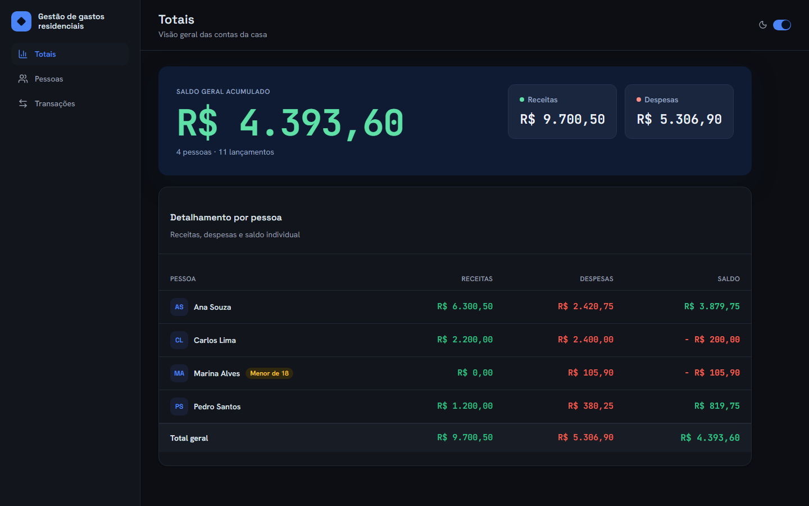
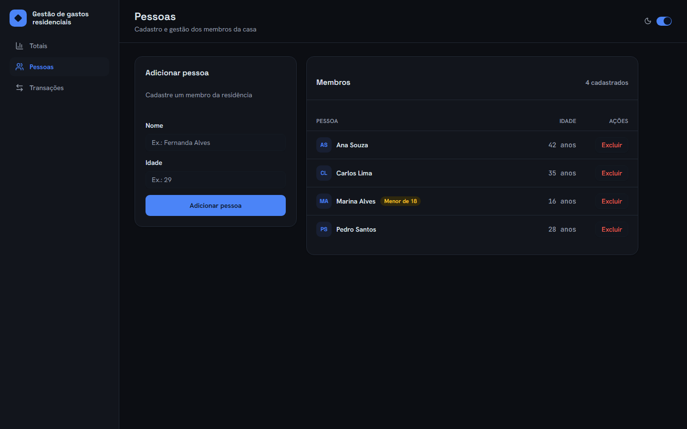
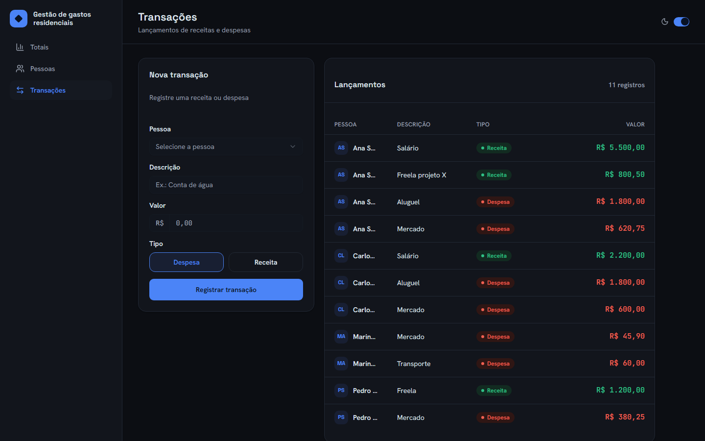
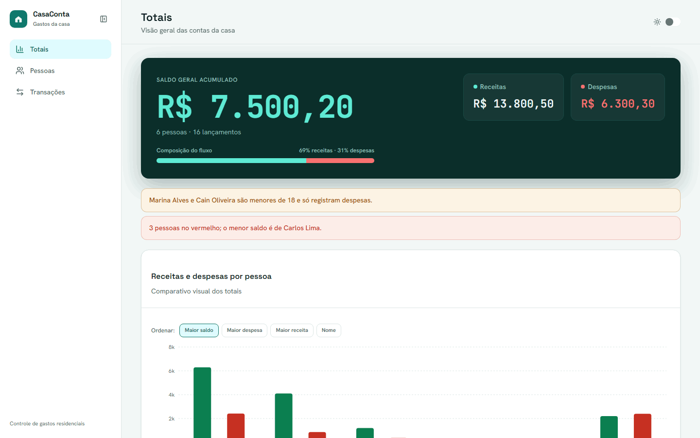

# Controle de Gastos Residenciais

[](https://github.com/caiovilquer/ControleGastos/actions/workflows/ci.yml)

Sistema para cadastro de pessoas, registro de receitas e despesas, e consulta de totais por pessoa e gerais. Backend em .NET 8 com SQLite; frontend em React 19 + TypeScript. No ambiente de desenvolvimento, o banco é criado e populado automaticamente no primeiro start.

## Demonstração visual









## Funcionalidades

### Pessoas

- Criação, listagem e exclusão.
- A deleção de uma pessoa remove suas transações associadas via cascade delete (configurado no EF Core).

### Transações

- Criação e listagem (incluindo listagem por pessoa).
- Pessoa menor de 18 anos só pode ter despesa.
- Essa regra é validada no backend (HTTP 422) e antecipada na UI: ao selecionar um menor, o tipo Receita fica desabilitado e um aviso é exibido.

### Totais

- Receitas, despesas e saldo por pessoa, mais o consolidado geral.
- Os totais são calculados exclusivamente no backend; o frontend apenas exibe o resultado.

## Stack e decisões

| Decisão | Justificativa |
| --- | --- |
| SQLite | Persistência em arquivo; o avaliador roda sem instalar servidor de banco. |
| EF Core sem camada extra de repository | O `DbContext` já implementa Unit of Work/Repository; camada adicional seria cerimônia no escopo. |
| FluentValidation só para formato; regras de negócio nos services | Validators cobrem campos obrigatórios, tamanhos e faixas; regras como “menor só despesa” ficam nos services. |
| 400 / 404 / 422 via `IExceptionHandler` global | 400 para erro de formato (FluentValidation), 404 para recurso inexistente, 422 para regra de negócio; mapeamento centralizado em `GlobalExceptionHandler`. |
| Enums como string no JSON (`JsonStringEnumConverter`) | Valores como `"Despesa"`/`"Receita"` deixam a API autoexplicativa no Swagger e no frontend. |
| Agregação de totais em memória | O provider SQLite do EF Core não traduz `Sum` sobre `decimal` para SQL; a projeção traz só as colunas necessárias e a agregação ocorre em LINQ. |
| Cascade delete explícito no `OnModelCreating` | `OnDelete(DeleteBehavior.Cascade)` na relação pessoa→transações, com testes cobrindo o comportamento. |
| Seed idempotente só em Development | Popula banco vazio no startup de desenvolvimento; não roda fora desse ambiente. |
| Testes em duas camadas (services + HTTP) | Services cobrem regras com SQLite in-memory; `WebApplicationFactory` valida o pipeline HTTP real (status codes, JSON, FluentValidation). |
| Vitest + Testing Library no frontend | Cobre UX da regra de menor de idade, validação de formulários e o cliente HTTP sem depender do backend rodando. |

## Como executar

### Pré-requisitos

- .NET 8 SDK
- Node.js 20.19+

### Backend

```bash
cd backend
dotnet run --project ControleGastos.Api
```

- API em `http://localhost:5153`
- Swagger em `http://localhost:5153/swagger` (ambiente Development)
- Banco SQLite (`controlegastos.db`) criado e populado automaticamente no primeiro start em Development

### Frontend

```bash
cd frontend
npm install
npm run dev
```

- App em `http://localhost:5173`
- O CORS do backend está configurado para essa origem (e para `http://localhost:4173` do `npm run preview`)

## Testes

### Backend

```bash
cd backend
dotnet test
```

Há dois níveis:

- **Unitários (services):** exercitam os services reais sobre SQLite in-memory, sem mock de `DbContext`, cobrindo constraints e cascade delete de fato.
- **Integração HTTP:** sobem a API com `WebApplicationFactory`, trocando só o banco por SQLite in-memory, e validam status codes (201/204/400/404/422), serialização JSON e o fluxo completo do desafio via HTTP.

### Frontend

```bash
cd frontend
npm test
```

Vitest + Testing Library cobrem o cliente HTTP (`api`), formatação, formulários (incluindo a UX de menor de idade só despesa) e a tabela de totais.

## Estrutura do projeto

```text
.
├── backend/      # API .NET 8, domínio, persistência e testes
│   ├── ControleGastos.Api/
│   └── ControleGastos.Tests/
├── frontend/     # aplicação React, UI e integração com API
├── docs/         # screenshots e GIF usados neste README
└── .github/      # workflow de CI (GitHub Actions)
```

## API

| Método | Rota | Descrição | Códigos de resposta |
| --- | --- | --- | --- |
| `GET` | `/api/pessoas` | Lista pessoas | `200` |
| `GET` | `/api/pessoas/{id}` | Obtém pessoa por id | `200`, `404` |
| `POST` | `/api/pessoas` | Cria pessoa | `201`, `400` |
| `DELETE` | `/api/pessoas/{id}` | Exclui pessoa e suas transações (cascade) | `204`, `404` |
| `GET` | `/api/transacoes` | Lista transações | `200` |
| `GET` | `/api/transacoes/pessoa/{pessoaId}` | Lista transações de uma pessoa | `200`, `404` |
| `GET` | `/api/transacoes/{id}` | Obtém transação por id | `200`, `404` |
| `POST` | `/api/transacoes` | Cria transação | `201`, `400`, `404`, `422` |
| `GET` | `/api/totais` | Totais por pessoa e gerais | `200` |
